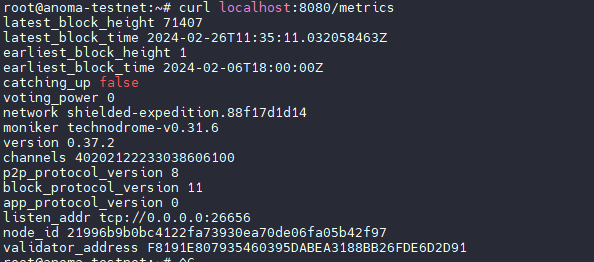

# namada-simple-node-exporter
Simple Node Exporter for custom Blockchain Metrics for Prometheus server
# Simple Node Exporter for Custom Blockchain Metrics

This is a simple node exporter designed to collect custom metrics from a blockchain node and expose them for scraping by a Prometheus server. It parses information from a status file provided by the blockchain node and formats the metrics in a way that Prometheus can understand.


## Usage
0. If u want securly scrap from localhost , change in bash script to u rpc public or localnode


1. Clone the repository:

    ```bash
    git clone https://github.com/yourusername/namada-simple-node-exporter.git
    ```

2. Navigate to the repository directory:

    ```bash
    cd namada-simple-node-exporter
    ```

3. Build the executable or run:

    ```bash
    go build or go run main.go
    ```

4. Run the exporter:

    ```bash
    ./namada-simple-node-exporter
    ```

By default, the exporter listens on port `8080`. You can change this port by modifying the code in `main.go`. in /metrics directory

## Configuration

Before running the exporter, make sure to configure the following:

- **Status File Path**: Ensure that the exporter has access to the status file provided by the blockchain node. You can set the path to the status file in the `URI` field of the `Exporter` struct in `main.go`.

## Metrics

The exporter exposes the following custom metrics:

- `latest_block_height`: The height of the latest block.
- `latest_block_time`: The time of the latest block.
- `earliest_block_height`: The height of the earliest block.
- `earliest_block_time`: The time of the earliest block.
- `catching_up`: Indicates whether the node is catching up (`true` or `false`).
- `voting_power`: The voting power of the validator.
- `network`: The network identifier.
- `moniker`: The node's moniker.
- `version`: The node's version.
- `channels`: The node's channels.
- `p2p_protocol_version`: The node's P2P protocol version.
- `block_protocol_version`: The node's block protocol version.
- `app_protocol_version`: The node's application protocol version.
- `listen_addr`: The node's listening address.
- `node_id`: The node's ID.
- `validator_address`: The validator's address.

## Contributing

Contributions are welcome! If you find any issues or have suggestions for improvements, please feel free to open an issue or a pull request.
